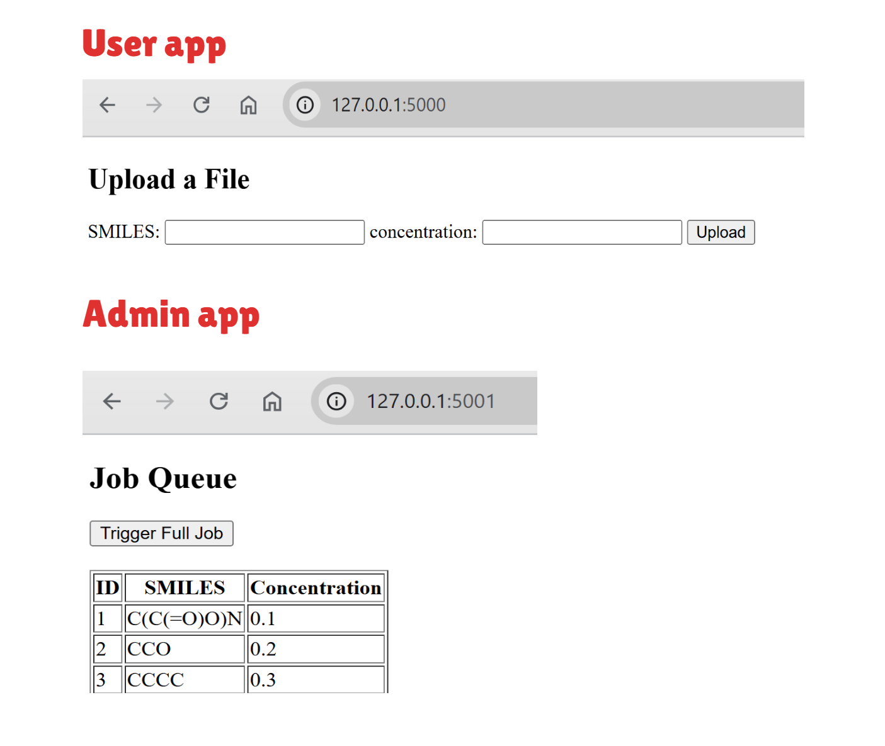

# Toy Flask App for Beginner

This toy flask app is a workable app with user app, admin app, and MySQL database. If you're a beginner, to make it run using Docker and local computer, we will need to install Docker and MySQL database in the computer. Let's start!  

## Steps to run the code

### Stage 1: Run all apps using Docker

To make the code running, you need  
1. Install Docker in your PC.
2. Run the code in VS-code terminal or terminal that your docker command work:  
    ```bash
    cd to/project/root/dir
    docker-compose up --build
    ```
3. Now, you can go to your web browser, access the user app at `http://localhost:5000` and admin app at `http://localhost:5001`. It works now!🎉 Check the image below.  
4. Optional, We can submit jobs in admin app, click the `Trigger Full Job` button and submit a job. What this job does? Find the corresponding code, and to demonstrate, in a separate terminal, run this command to this output (In real app, this job can be replaced by more complex one):  
    ```bash
    docker-compose exec admin_app celery -A tasks worker --loglevel=info
    ```  

Note, to reset the MySQL Container and Rerun and project:  
```bash
docker-compose down -v
docker-compose up --build
```



### Stage 2: Run user app only without Docker

Let us now go back a bit and run only user app without Docker (Note: Close your docker container before doing this part). For this, you need install MySQL database. Let's start:  
1. Install MySQL database. Checkout this video: https://www.youtube.com/watch?v=EnQTuLAyI7o. You can find more information online about this. Note: set matched password. 
2. Let's run user app only in your terminal (you need to install proper packages):
    ```bash
    cd user_app
    flask run --debug
    ```
3. Access the user app at `http://localhost:5000`. Upload one entry? If you see error, because we don't initiate and connect our local MySQL database.  
4. Initiate the MySQL database. Run: 
    ```sql
    CREATE DATABASE IF NOT EXISTS jobs_db;
    USE jobs_db;
    ```
    run `init.sql` code in MySQL workbench.  
5. Take a quick look at our database. 
    ```sql
    USE jobs_db;
    SELECT * FROM files;
    ```
    You should see three entries inserted from our `init.sql` (Same to the image above). In our web browser, insert one entries, might be `SMILES: cc` and `Concentration: 0.1 M` (Just random...). Run `SELECT * FROM files;` again, you should see the new entries and now we're done!🎉   

Note that remember to stop the MySQL service after finishing.  

### Final Stage: Showcase

1. Show you can run the code
2. Show new entries in your MySQL Workbench
3. Propose at lease one way to improve the code.

## Contributing

Feel free to fork this repository and/or submit issues for any bugs. Code is tested under Windows 11 OS. If you encounter any bugs/issues from your side, let us know!  